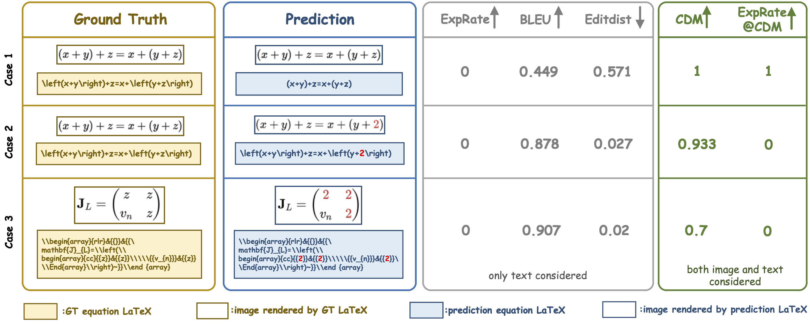
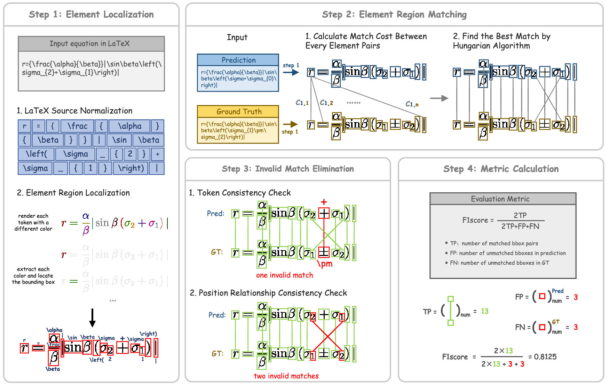

<div align="center">

[English](./README.md) | [简体中文]

<h1>Image Over Text: Transforming Formula Recognition Evaluation with Character Detection Matching</h1>

[[ 论文 ]](https://arxiv.org/pdf/2409.03643) [[ 网站 ]](https://github.com/opendatalab/UniMERNet/tree/main/cdm)
[[在线Demo 🤗(Hugging Face)]](https://huggingface.co/spaces/opendatalab/CDM-Demo)

</div>


# 概述

公式识别因其复杂的结构和多样的符号表示而面临重大挑战。尽管公式识别模型不断进步，但现有评估指标如 BLEU 和编辑距离仍存在显著局限性。这些指标忽视了同一公式的多种表示形式，并对训练数据的分布高度敏感，导致评估不公。为此，我们提出了字符检测匹配（CDM）指标，通过设计基于图像而非 LaTeX 的评分方法来确保评估的客观性。具体而言，CDM 将模型预测的 LaTeX 和真实 LaTeX 公式渲染为图像格式，然后使用视觉特征提取和定位技术进行精确的字符级匹配，结合空间位置信息。相比于仅依赖文本字符匹配的 BLEU 和编辑距离，CDM 提供了更准确和公平的评估。

CDM与BLEU、EditDistance等指标对比示意图：

<div align="center">
    
</div>

> 从上述对比图中可以看出：
- Case1: 模型预测正确，理论上ExpRate/BLEU/EditDist应该为1/1/0，实际上为0/0.449/0.571，完全无法反应识别准确性；
- Case2 Vs Case1: 预测错误的模型(Case2) BLEU/EditDist指标确远优于识别正确的模型结果(Case1)；
- Case3: 模型预测错误较多，而BLEU指标确高达0.907，不符合直觉。


CDM的算法流程图如下：

<div align="center">
    
</div>

可以看到CDM基于渲染图像的字符匹配方式，结果更加直观，且不受公式表达多样性影响。


#

# 使用方法

## 在线Demo体验

请点击HuggingFace Demo链接: [(Hugging Face)🤗](https://huggingface.co/spaces/opendatalab/CDM-Demo)

## 本地安装CDM

CDM需要对公式进行渲染，需要相关依赖包，推荐在Linux系统安装配置

## 准备环境

需要的依赖包括：Nodejs, imagemagic, pdflatex，请按照下面的指令进行安装：

### 步骤.1 安装 nodejs

```
wget https://registry.npmmirror.com/-/binary/node/latest-v16.x/node-v16.13.1-linux-x64.tar.gz

tar -xvf node-v16.13.1-linux-x64.tar.gz

mv node-v16.13.1-linux-x64/* /usr/local/nodejs/

ln -s /usr/local/nodejs/bin/node /usr/local/bin

ln -s /usr/local/nodejs/bin/npm /usr/local/bin

node -v
```

### 步骤.2 安装 imagemagic

`apt-get`命令安装的imagemagic版本是6.x，我们需要安装7.x的，所以从源码编译安装：

（编译前需要确认系统内安装有libpng-dev，否则编译出来的magick无法支持cdm使用）
```
git clone https://github.com/ImageMagick/ImageMagick.git ImageMagick-7.1.1

cd ImageMagick-7.1.1

./configure

make

sudo make install

sudo ldconfig /usr/local/lib

convert --version
```

### 步骤.3 安装 latexpdf

渲染中文公式需要中文字体，当前cdm中使用的是思源黑体Source Han Sans SC.

```
apt-get update

sudo apt-get install texlive-full
```

### step.4 安装 python 依赖

```
pip install -r requirements.txt
```


## 使用CDM

如果安装过程顺利，现在可以使用CDM对公式识别的结果进行评测了。

### 1. 批量评测

- 准备输入的json文件

在UniMERNet上评测，可以用下面的脚本获取json文件:

```
python convert2cdm_format.py -i {UniMERNet predictions} -o {save path}
```

或者，也可以参考下面的格式自行准备json文件:

```
[
    {
        "img_id": "case_1",      # 非必须的key
        "gt": "y = 2z + 3x",
        "pred": "y = 2x + 3z"
    },
    {
        "img_id": "case_2",
        "gt": "y = x^2 + 1",
        "pred": "y = x^2 + 1"
    },
    ...
]
```

`注意在json文件中，一些特殊字符比如 "\" 需要进行转义, 比如 "\begin" 在json文件中就需要保存为 "\\begin".`

- 评测:

```
python evaluation.py -i {path_to_your_input_json}
```

### 2. 启动 gradio demo

```
python app.py
```
